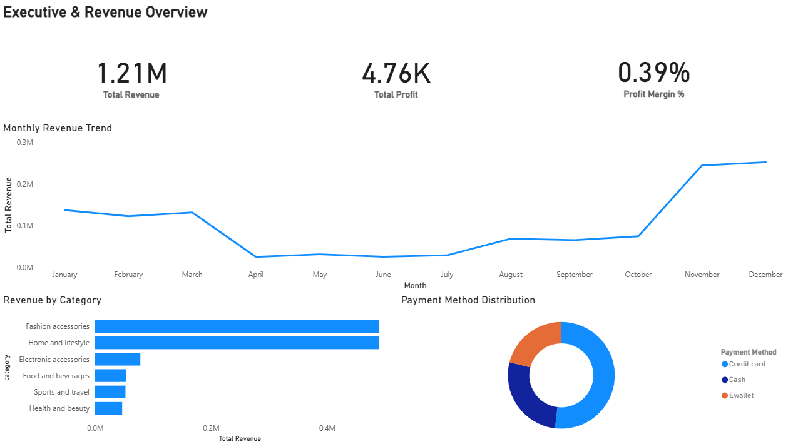
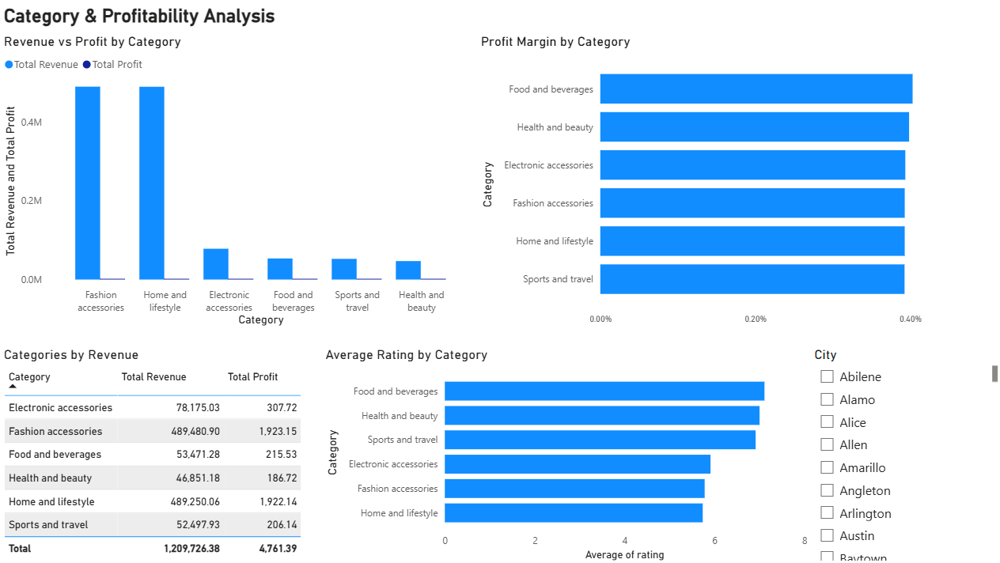
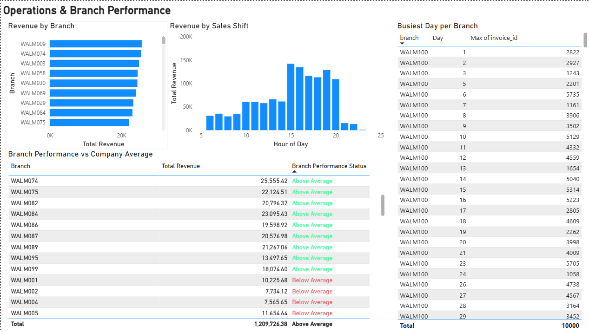

# 📊 Walmart Sales Data Analysis

##  Project Overview
This project presents an end-to-end sales analysis of Walmart retail data, focusing on revenue performance, product profitability, and branch-level operational insights. The workflow covers data cleaning and feature engineering using Python, SQL-based business analysis using PostgreSQL, and executive dashboard development using Power BI.

The objective of this project is to transform raw transactional data into actionable business insights through structured analysis and professional dashboarding.

---

##  Tools & Technologies
- **Python**: Pandas, SQLAlchemy
- **Database**: PostgreSQL
- **Visualization**: Power BI
- **Notebook**: Jupyter
- **Version Control**: Git & GitHub

---

##  Data Preparation & Cleaning
- Loaded raw Walmart sales data using Pandas
- Handled missing values and duplicate records
- Standardized column names and corrected data types
- Engineered key metrics including:
  - Total Revenue
  - Total Profit
  - Profit Margin
  - Sales Hour and Date attributes
- Loaded the cleaned dataset into PostgreSQL for analysis

---

##  Business Questions Answered
- What are the total revenue, total profit, and overall profit margin?
- Which product categories generate the highest revenue and profit?
- How do profit margins vary across categories?
- What payment methods are most commonly used by customers?
- Which branches perform above or below the company average?
- What are the busiest shopping hours and days across branches?
- How do customer ratings vary by product category?

---

##  Power BI Dashboards

### 1️⃣ Executive & Revenue Overview
Provides a high-level view of business performance, including:
- Total Revenue, Total Profit, and Profit Margin KPIs
- Monthly revenue trends
- Revenue contribution by product category
- Payment method distribution

---

### 2️⃣ Product & Profitability Analysis
Focuses on product-level performance:
- Revenue vs Profit by category
- Profit margin comparison across categories
- Average customer ratings by category
- Drill-down analysis using city-level filters

---

### 3️⃣ Operations & Branch Performance
Analyzes operational efficiency and branch performance:
- Revenue comparison across branches
- Sales distribution by time of day
- Busiest day per branch based on transactions
- Branch performance benchmarked against company average using DAX

---

##  Key Insights
- Fashion accessories and home & lifestyle categories drive the majority of revenue
- Profit margins are consistently low, reflecting high-volume retail dynamics
- Several branches outperform the company average and can serve as operational benchmarks
- Peak sales occur during afternoon and evening hours
- Customer ratings vary across categories, highlighting opportunities for product improvement

---
##  Key Takeaways
This project demonstrates the ability to:
- Perform end-to-end data analysis using Python, SQL, and Power BI
- Translate business questions into analytical queries
- Build clean, executive-level dashboards with consistent design
- Apply DAX logic for performance benchmarking
- Present insights in a clear and business-focused manner

---

##  Future Enhancements
- Add year-over-year revenue comparison
- Automate data refresh using Power BI Service
- Expand analysis with customer segmentation
- Integrate forecasting for demand prediction
